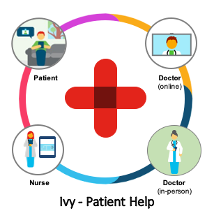
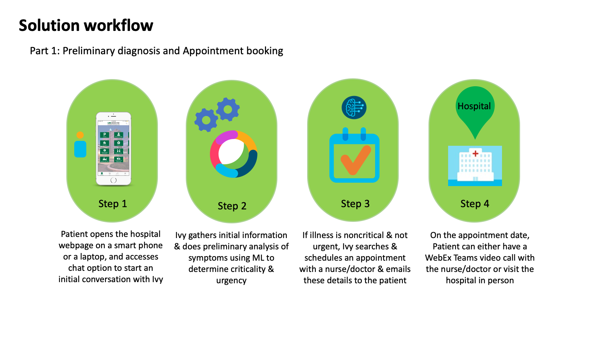
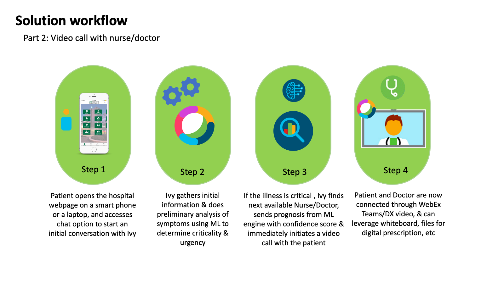
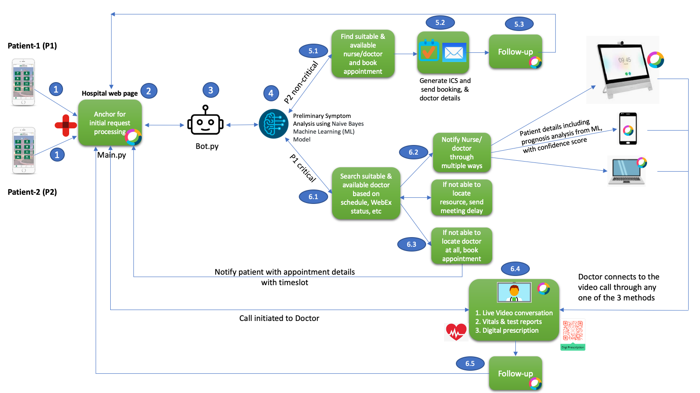
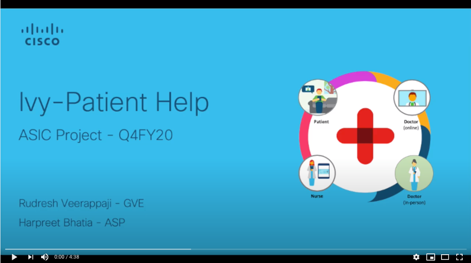

# Ivy - Patient Help
Healthcare in your palms!

<p align="center">
  
</p>
 
  
## Use case / Introduction

Healthcare just like any other industry is undergoing rapid digitization, and in the recent past the need for this has increased many fold due to COVID resulting in complete and partial lockdowns making it difficult for patients to get the medical care at the right time on one hand, and on the other the medical systems are overwhelmed by the increased load. There is no better time than now to leverage technologies and solutions to solve the issues of Healthcare vertical, and address areas of faster diagnosis, faster access to front line medical staff and doctors. With this goal in mind, we have designed a solution that addresses some of these issues, by leveraging Cisco's collaboration and networking products by building on top of the open and programmable principles that these are built upon.


## Problem statement

Healthcare experience for both patients and medical staff including doctors needs to drastically improve by adopting technologies, especially in this current reality of a spreading pandemic, resulting partial/complete lockdowns and overwhelmed medical infrastructures across the world. Now more than ever there is need for faster intial diagnosis, access to front line medical staff and to doctors by leveraging technologies that enable optimizations including virtual services.


## Solution

The solution we have built with this project addresses multiple aspects of Healthcare services into a conslidated solution, with a holistic approach. The solution is built on reliable, cutting edge technologies offered by Cisco, and also integrations with open source solutions to extend the capabilities easily. Here are the list of major use cases offered:
  1. First point of contact for patients to get speedy access to health care services.
  2. Easy integration to existing hospital infrastructure through webex teams.
  3. Interactive patient help bot, with symptom analytics for initial prognosis, based on Naive Bayes Machine Learning (ML) model and sharing this analysis to nurse/doctor for further analysis.
  4. Virtual appointment booking for non-critical diseases based on initial diagnosis.
  5. Immediate search, locate and connect to nurses or specialist doctors using webex video calls to phones/laptops/Webex DXs, if the criticality of the disease is higher, per ML analysis.
  6. Secure exchange of test reports and vitals from smart wearables from patient to doctor, and secure digital prescription exchange from doctor to patient/pharmacy.
  7. Secure patient database tracking and anytime information retrieval.
  8. Post consulation followup and future appointment scheduling.

With the goal of a comprehensive healthcare solution for patients and nurses/doctors, here are two major workflows that encompasses the above use cases. 

#### Workflow-1
##### Non Critical - Preliminary diagnosis & Appointment booking
A patient accesses hospital portal online through a smartphone, securely shares symptoms to a anchor module powered by Webex teams, and the bot module does prelimary analysis of the symptoms based on Naive Bayes Machine Learning (ML) model & directs the patient to a nurse or doctor based on the criticality of the illness. Bot module will check the expertize, schedule and availability of doctors and book an appointment for the earliest available slot and shares this information to both patient & nurse/doctors.

<p align="center">
  
</p>

#### Workflow-2
##### Critical - Preliminary diagnosis & Immediate virtual assistance

If the illness is critical based on the prelimnary analysis of the symptoms, bot module will find a resource based on doctor/Nurse's webex team space status (which can be either manually set by the person or automatic detection like whether on call or not on duty or etc) and if the status is available and on duty, the best available doctor that matches medical expertise to the symptoms of the patient will be picked, and a webex video call will be initiated. Further, Machine learning based symptom analysis results namely the prognisis and confidence score, vitals and test reports sharing, digital prescription sharing etc can be used by leveraging the webex teams services.


<p align="center">
  
</p>


## Solution Components
 
* Webex Teams
* Webex DX80 (optional)
* HTML
* Python
* Naive Bayes Machine Learning (ML) model (open source)
* Secure QR Code (open source)
* Ngrok (optional)
 

## Solution workflow

<p align="center">
  
</p>


## Cisco Products
* Cisco Webex Teams
* Cisco Webex DX80 (Optional)
 
 
## Demo

The following demo illustrates the above described two major workflows of a patient leveraging our solution, including patient database tracking, symptom analysis using Naive Bayes ML model, intelligent assigning of docotors/nurses, Digital prescription, secure vitals & test report exchange between patient & nurse/doctor only - of these through native modules or leveraging APIs where required to illustrate the integration of webex teams and the power of the platform to provide such a ecosystem. In the demo we are illustrating the solution using a ficticious hospital called "Medi-Plus+".


[](https://youtu.be/-q5kTo_u4I4)


## Prerequisites
* Python 3.x
* Text editor
* Flask
* Webex bot token
* Webex guest issuer app id and secret
* Webex user token
* Python libraries in req.txt
* An email account

## Installation


1. Clone this repository <b>Change after pushing the repo to CiscoSE</b>
```
git clone https://wwwin-github.cisco.com/rudreshveerappaji/Ivy-patient-help.git
```


2. Configure a .env file in the code directory under config folder with all the necessary environment variables (replace with your values)
```
BOT_EMAIL = 'Bot Email'
BOT_TOKEN = 'Bot Token'
BOT_URL = 'Bot URL'
BOT_NAME = 'Bot Name'
GUEST_ISSUER_ID = 'Guest Issuer APP ID'
GUEST_ISSUER_SECRET = 'Guest Issuer APP Secret'
GMAIL_PASSWORD = "Mail Password"
WEBEX_USER_TOKEN = "User Token"
```

3. Create a virtual environment for the python code
```
python -m venv /path/to/new/virtual/environment
```


4. Activate the newly created virtual environment
```
source venv/bin/activate
```


5. Install the required libraries into the virtual environment, inside the venv folder
```
pip install -r req.txt
```


6. Run the bot.py on a publicly acessible URL using ngrok(used in this project)
```
Ngrok Docs - 
  https://ngrok.com/docs
Start ngrok tunnel - (run on a terminal)
  ./ngrok http 8080
Run the bot -
  python bot.py
```


7. Run main.py to serve the main page using flask
```
python = main.py
```

## Conclusion

The solution proposed and validated here with this prototype, can be easily integrated in a Hospital or Medical environment by leveraging Cisco, open source &  3rd party healthcare products to achieve better user experience for patient & nurse/doctor interactions. 

Here are the top benefits of using this solution:
  1. Reduced time for adoption : Quick adoption of the solution without the need for network redesign of physical infrastructure.
  2. Improved patience and nurse/doctor experience even while being remote : Any device, any where, any time
  3. Faster response times for both prelimary diagnosis and subsequent diagnosis.
  4. Option Video integrations like with DX for better video experience.
  5. QR code based Digital prescription using whiteboard or other such tools integration and secure exchange between doctor, patient and pharmacy
  6. Sensors like Samsung wearables, etc that measure medical vitals like pulse rate, respiration rate, heart rate, BP, temperature etc can be remotely measured integrated to the solution.
  7. AI/ML integration to enhance prelimary diagnosis, on top of the platform that this solution provides.
  8. Replicable solution model which can be adapted to any other industry for similar benefits.

Future enhancements would include:
  1. Natural Language processing through integration with mindmeld.
  2. Sentiment analysis for automatic two way feedback.
  3. Webex Assistant integration for note taking and transcript generation for records.
  4. Blockchain integration for patient & doctor data.
  5. Integration with smart wearables & fitness apps for richer & real-time data access.

## Authors

* Rudresh Veerappaji (rudv@cisco.com)
* Abhijith Ramesh Chandra (abhr@cisco.com)
* Harpreet Bhatia (harbhati@cisco.com)

## License
Provided under Cisco Sample Code License, for details see [LICENSE](https://github.com/CiscoSE/erx_project/blob/master/LICENSE)

## Code of Conduct

Our code of conduct is available [here](https://github.com/rudreshveerappaji/Ivy-patient-help/blob/master/CODE_OF_CONDUCT.md)


## Contributing

See our contributing guidelines [here](https://github.com/rudreshveerappaji/Ivy-patient-help/blob/master/CONTRIBUTING.md)


## DISCLAIMER:

Please note: This script is meant for demo purposes only. All tools/ scripts in this repo are released for use "AS IS" without any warranties of any kind, including, but not limited to their installation, use, or performance. Any use of these scripts and tools is at your own risk. There is no guarantee that they have been through thorough testing in a comparable environment and we are not responsible for any damage or data loss incurred with their use. You are responsible for reviewing and testing any scripts you run thoroughly before use in any non-testing environment.

